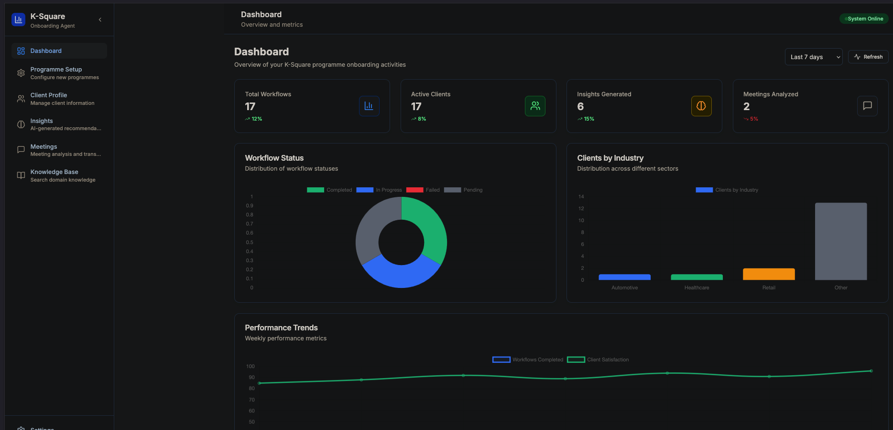
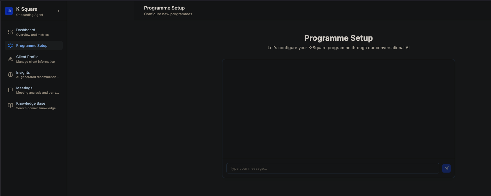

# K-Square Programme Onboarding Agent

An AI-powered system designed to streamline the onboarding process for programme execution teams following project acquisition. The system combines a conversational AI interface with a visual knowledge base to deliver domain-specific insights, client profiles, and actionable recommendations.

## System Requirements

- **Python**: 3.8 or higher
- **Node.js**: 16.0 or higher
- **npm**: 8.0 or higher
- **Operating System**: macOS, Linux, or Windows

## Quick Start Guide

### 1. Clone and Navigate to Project

```bash
git clone <repository-url>
cd KS-onboarding
```

### 2. Backend Setup

#### Install Python Dependencies

```bash
# Create virtual environment (recommended)
python -m venv venv

# Activate virtual environment
# On macOS/Linux:
source venv/bin/activate
# On Windows:
venv\Scripts\activate

# Install dependencies
pip install -r requirements.txt
```

#### Start Backend Server

```bash
# From project root directory (IMPORTANT: Must be run from root, not backend folder)
python -m uvicorn main:app --reload --host 0.0.0.0 --port 8000
```

**⚠️ Important:** Always run the backend server from the project root directory (`KS-onboarding/`), not from the `backend/` subdirectory. This ensures proper module imports.

The backend API will be available at: `http://localhost:8000`

### 3. Frontend Setup

#### Install Node.js Dependencies

```bash
# Navigate to frontend directory
cd frontend

# Install dependencies
npm install
```

#### Start Frontend Development Server

```bash
# From frontend directory
npm run dev
```

The frontend application will be available at: `http://localhost:3000`

## Running the Complete Application

### Option 1: Manual Setup (Two Terminal Windows)

**Terminal 1 - Backend:**
```bash
# Navigate to the PROJECT ROOT directory (not backend/)
cd /path/to/KS-onboarding

# Activate virtual environment
source venv/bin/activate  # On macOS/Linux
# OR on Windows: venv\Scripts\activate

# Run server from ROOT directory
python -m uvicorn main:app --reload --host 0.0.0.0 --port 8000
```

**Terminal 2 - Frontend:**
```bash
cd /path/to/KS-onboarding/frontend
npm run dev
```

### Option 2: Using Shell Script (Recommended)

Create a startup script for easier management:

**start.sh** (macOS/Linux):
```bash
#!/bin/bash

# Start backend in background
echo "Starting backend server..."
source venv/bin/activate
python -m uvicorn main:app --reload --host 0.0.0.0 --port 8000 &
BACKEND_PID=$!

# Start frontend in background
echo "Starting frontend server..."
cd frontend
npm run dev &
FRONTEND_PID=$!

echo "Backend PID: $BACKEND_PID"
echo "Frontend PID: $FRONTEND_PID"
echo "Application is running at http://localhost:3000"
echo "API is available at http://localhost:8000"
echo "Press Ctrl+C to stop both servers"

# Wait for interrupt signal
trap 'kill $BACKEND_PID $FRONTEND_PID; exit' INT
wait
```

Make it executable and run:
```bash
chmod +x start.sh
./start.sh
```

## Project Structure

```
KS-onboarding/
├── backend/                 # Python FastAPI backend
│   ├── agents/             # AI agent implementations
│   ├── database/           # Database management
│   └── main.py            # FastAPI application entry
├── frontend/               # React TypeScript frontend
│   ├── src/
│   │   ├── components/    # Reusable UI components
│   │   ├── pages/         # Application views
│   │   └── services/      # API service layer
│   └── package.json       # Frontend dependencies
├── doc/                    # Documentation
├── meetings/              # Meeting recordings and transcripts
├── main.py                # Application entry point
├── requirements.txt       # Python dependencies
└── ks_onboarding.db      # SQLite database
```

## Troubleshooting

### Common Issues

#### "ModuleNotFoundError: No module named 'agents'"

**Problem:** This error occurs when trying to run the backend server from the wrong directory.

**Solution:** Always run the backend server from the project root directory (`KS-onboarding/`), not from the `backend/` subdirectory.

```bash
# ❌ WRONG - Don't run from backend directory
cd KS-onboarding/backend
python -m uvicorn main:app --reload

# ✅ CORRECT - Run from project root
cd KS-onboarding
python -m uvicorn main:app --reload
```

#### "Address already in use" Error

**Problem:** Port 8000 is already occupied by another process.

**Solution:** Use a different port or kill the existing process:

```bash
# Use different port
python -m uvicorn main:app --reload --host 0.0.0.0 --port 8001

# Or find and kill existing process
lsof -ti:8000 | xargs kill -9
```

#### Virtual Environment Issues

**Problem:** Dependencies not found or wrong Python version.

**Solution:** Ensure virtual environment is properly activated:

```bash
# Create new virtual environment if needed
python3 -m venv venv

# Activate virtual environment
source venv/bin/activate  # macOS/Linux
# OR
venv\Scripts\activate     # Windows

# Verify activation (should show venv path)
which python

# Reinstall dependencies if needed
pip install -r requirements.txt
```

### Project Portability

This project is designed to work on any computer with the following setup:

1. **Python 3.8+** installed
2. **Node.js 16+** installed
3. **Git** for cloning the repository
4. **Virtual environment** properly configured
5. **Run from project root** directory

The import paths have been configured to use relative imports, making the project portable across different systems and directory structures.

## Application Features

### Dashboard
- System metrics and performance indicators
- Workflow status tracking
- Client distribution analytics
- Real-time activity monitoring

### Client Profiles
- Comprehensive client information management
- Industry categorisation and analysis
- Stakeholder tracking
- Completeness scoring

### Insights Generation
- AI-powered strategic recommendations
- Risk assessment and mitigation
- Opportunity identification
- Impact scoring and prioritisation

### Meeting Analysis
- Automated transcript processing
- Sentiment and engagement analysis
- Action item extraction
- Key topic identification

### Knowledge Base
- Searchable documentation repository
- Category-based organisation
- Relevance scoring
- Bookmark and sharing capabilities

### Programme Setup
- Conversational AI-guided setup
- Progressive data collection
- Validation and completeness tracking
- Automated workflow initiation

## Database

The application uses SQLite for data persistence. The database file (`ks_onboarding.db`) is automatically created in the project root directory on first run.

## API Documentation

Once the backend is running, you can access the interactive API documentation at:
- Swagger UI: `http://localhost:8000/docs`
- ReDoc: `http://localhost:8000/redoc`

## Troubleshooting

### Common Issues

1. **Port Already in Use**
   ```bash
   # Check what's using the port
   lsof -i :8000  # For backend
   lsof -i :3000  # For frontend
   
   # Kill the process if needed
   kill -9 <PID>
   ```

2. **Python Dependencies Issues**
   ```bash
   # Upgrade pip
   pip install --upgrade pip
   
   # Reinstall requirements
   pip install -r requirements.txt --force-reinstall
   ```

3. **Node.js Dependencies Issues**
   ```bash
   # Clear npm cache
   npm cache clean --force
   
   # Delete node_modules and reinstall
   rm -rf node_modules package-lock.json
   npm install
   ```

4. **Database Issues**
   ```bash
   # Delete and recreate database
   rm ks_onboarding.db
   # Restart backend server to recreate
   ```

### Environment Variables

Optional environment variables for configuration:

```bash
# Backend configuration
export BACKEND_HOST=0.0.0.0
export BACKEND_PORT=8000
export DATABASE_URL=sqlite:///./ks_onboarding.db

# Frontend configuration
export VITE_API_BASE_URL=http://localhost:8000
```

## Development

### Backend Development
- FastAPI with automatic reload enabled
- SQLite database with SQLAlchemy ORM
- Pydantic models for data validation
- CORS enabled for frontend integration

### Frontend Development
- React 18 with TypeScript
- Vite for fast development and building
- TailwindCSS for styling
- React Query for state management
- Framer Motion for animations

## Production Deployment

For production deployment, consider:

1. **Backend**: Use a production WSGI server like Gunicorn
2. **Frontend**: Build static files with `npm run build`
3. **Database**: Migrate to PostgreSQL or MySQL for production
4. **Environment**: Set appropriate environment variables
5. **Security**: Configure HTTPS and proper CORS settings

## Support

For issues or questions:
1. Check the troubleshooting section above
2. Review the API documentation at `/docs`
3. Examine browser console and terminal logs for errors
4. Ensure all dependencies are properly installed


## Screenshots and Demo

### Dashboard Overview

The main dashboard provides a comprehensive view of ongoing onboarding processes, key metrics, and system status. Current components include:

- Activity Timeline
- Client Status Cards
- Performance Metrics
- Knowledge Base Quick Access
- Recent Interactions Log
- Task Priority Queue

### Setup Wizard

The AI-guided setup process walks users through programme initialization with contextual assistance. Current features:

- Step-by-step Configuration
- Real-time Validation
- Progress Tracking
- Dynamic Recommendations
- Document Upload Interface
- Team Role Assignment
### Demo Video

https://user-images.githubusercontent.com/123456/demo-onboarding.mp4

<video width="100%" controls>
  <source src="https://github.com/KSProjectX/KS-onboarding/blob/poc/demo-onboarding.mp4" type="video/mp4">
  Your browser does not support the video tag.
</video>

Watch the demo video above to see the assistant agent in action, demonstrating:
- Natural conversation flow
- Real-time response generation  
- Context awareness
- Document processing capabilities
- Knowledge base integration

## Evolution Roadmap

This Proof of Concept (PoC) represents the initial phase of the system. Future evolutionary phases include:

### Phase 1: Enhanced Conversational Intelligence
- Advanced natural language understanding
- Context-aware responses
- Multi-turn conversation handling
- Personalized interaction patterns
- Emotional intelligence integration
- Learning from user interactions

### Phase 2: Information Processing Capabilities
- Automated meeting summary generation
- Document analysis and extraction
- Cross-reference capabilities
- Knowledge base integration
- Smart search functionality
- Historical context awareness

### Phase 3: External Data Integration
- Industry database connections
- Market intelligence feeds
- Regulatory compliance updates
- Competitor analysis integration
- Economic indicators tracking
- News and trends monitoring

### Phase 4: Information Verification Framework
- Fact-checking mechanisms
- Source credibility assessment
- Cross-validation protocols
- Automated verification agents
- Confidence scoring system
- Audit trail generation

## License

Internal use only - K-Square Group


## License

Internal use only - K-Square Group


