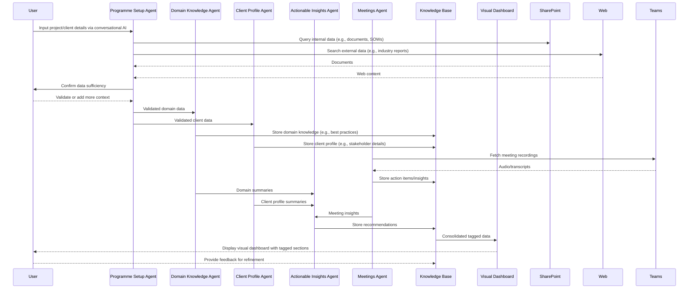
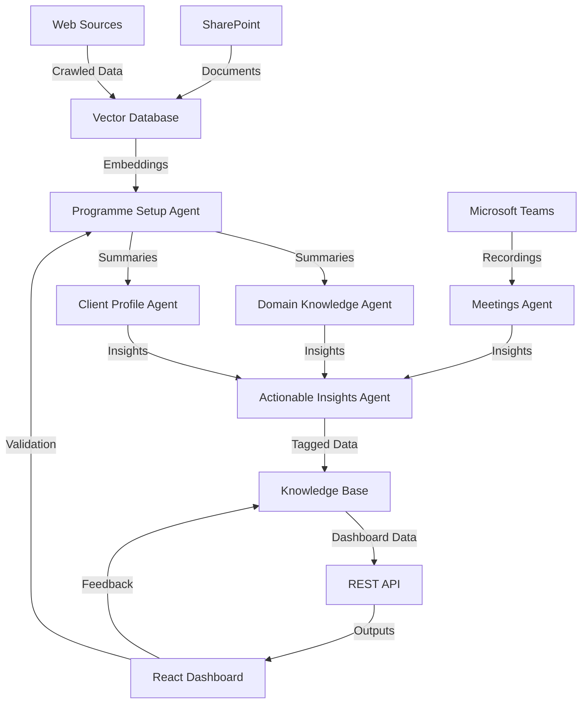
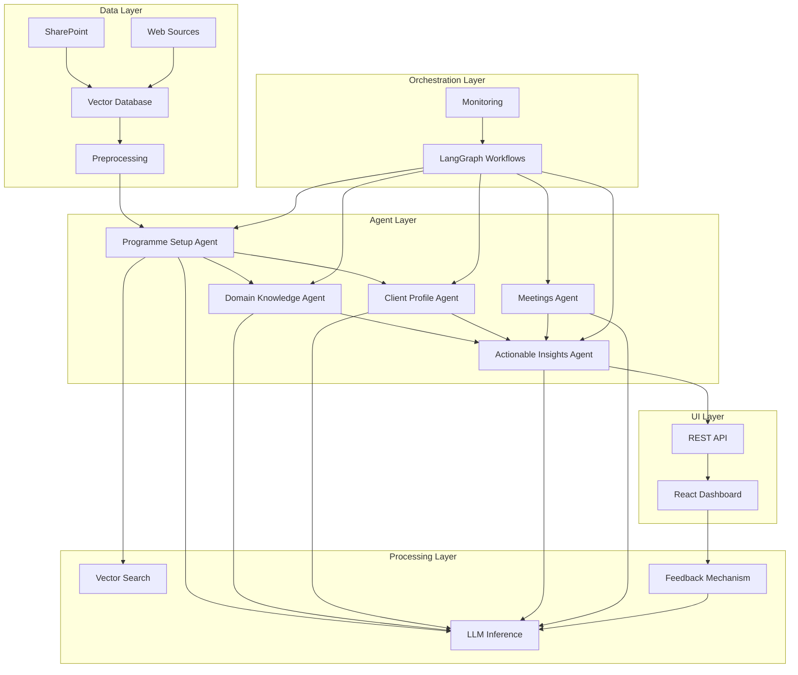
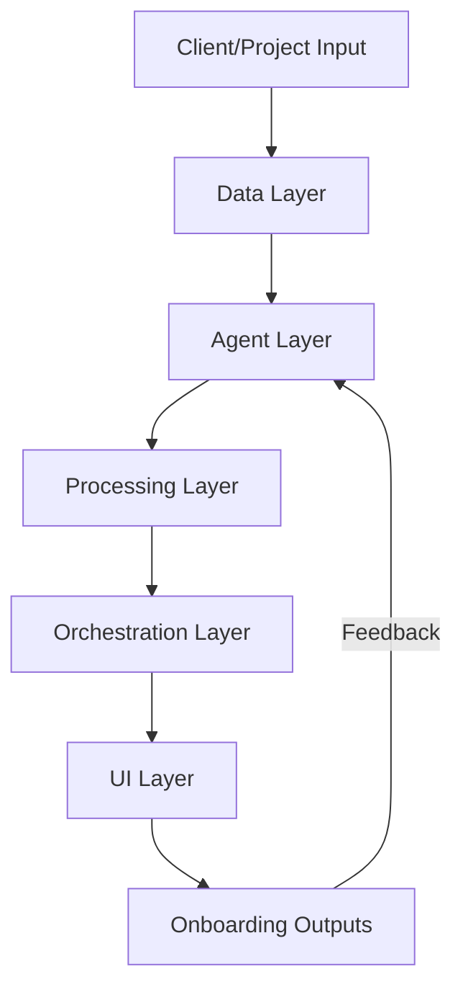

```mermaid
sequenceDiagram
    participant User
    participant PSA as Programme Setup Agent
    participant DKA as Domain Knowledge Agent
    participant CPA as Client Profile Agent
    participant AIA as Actionable Insights Agent
    participant MA as Meetings Agent
    participant KB as Knowledge Base
    participant UI as Visual Dashboard
    participant SharePoint
    participant Web
    participant Teams

    User->>PSA: Input project/client details via conversational AI
    PSA->>SharePoint: Query internal data (e.g., documents, SOWs)
    PSA->>Web: Search external data (e.g., industry reports)
    SharePoint-->>PSA: Documents
    Web-->>PSA: Web content
    PSA->>User: Confirm data sufficiency
    User-->>PSA: Validate or add more context
    PSA->>DKA: Validated domain data
    PSA->>CPA: Validated client data
    DKA->>KB: Store domain knowledge (e.g., best practices)
    CPA->>KB: Store client profile (e.g., stakeholder details)
    MA->>Teams: Fetch meeting recordings
    Teams-->>MA: Audio/transcripts
    MA->>KB: Store action items/insights
    DKA->>AIA: Domain summaries
    CPA->>AIA: Client profile summaries
    MA->>AIA: Meeting insights
    AIA->>KB: Store recommendations
    KB->>UI: Consolidated tagged data
    UI-->>User: Display visual dashboard with tagged sections
    User-->>KB: Provide feedback for refinement
```

```mermaid
graph TD
    A[SharePoint] -->|Documents| B[Vector Database]
    C[Web Sources] -->|Crawled Data| B
    B -->|Embeddings| D[Programme Setup Agent]
    D -->|Summaries| E[Domain Knowledge Agent]
    D -->|Summaries| F[Client Profile Agent]
    G[Microsoft Teams] -->|Recordings| H[Meetings Agent]
    E -->|Insights| I[Actionable Insights Agent]
    F -->|Insights| I
    H -->|Insights| I
    I -->|Tagged Data| J[Knowledge Base]
    J -->|Dashboard Data| K[REST API]
    K -->|Outputs| L[React Dashboard]
    L -->|Feedback| J
    L -->|Validation| D
```

```mermaid
graph TD
    subgraph Data Layer
        A1[SharePoint]
        A2[Web Sources]
        A3[Vector Database]
        A4[Preprocessing]
        A1 --> A3
        A2 --> A3
        A3 --> A4
    end

    subgraph Agent Layer
        B1[Programme Setup Agent]
        B2[Domain Knowledge Agent]
        B3[Client Profile Agent]
        B4[Actionable Insights Agent]
        B5[Meetings Agent]
        A4 --> B1
        B1 --> B2
        B1 --> B3
        B2 --> B4
        B3 --> B4
        B5 --> B4
    end

    subgraph Processing Layer
        C1[LLM Inference]
        C2[Vector Search]
        C3[Feedback Mechanism]
        B1 --> C1
        B1 --> C2
        B2 --> C1
        B3 --> C1
        B4 --> C1
        B5 --> C1
        C3 --> C1
    end

    subgraph UI Layer
        D1[React Dashboard]
        D2[REST API]
        B4 --> D2
        D2 --> D1
        D1 --> C3
    end

    subgraph Orchestration Layer
        E1[LangGraph Workflows]
        E2[Monitoring]
        E1 --> B1
        E1 --> B2
        E1 --> B3
        E1 --> B4
        E1 --> B5
        E2 --> E1
    end
```

```mermaid
graph TD
    A[Client/Project Input] --> B[Data Layer]
    B --> C[Agent Layer]
    C --> D[Processing Layer]
    D --> E[Orchestration Layer]
    E --> F[UI Layer]
    F --> G[Onboarding Outputs]
    G -->|Feedback| C
```
