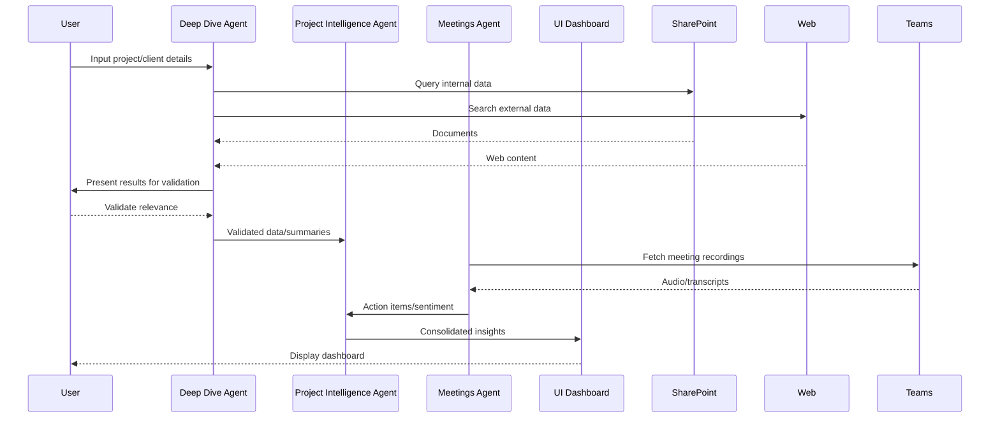
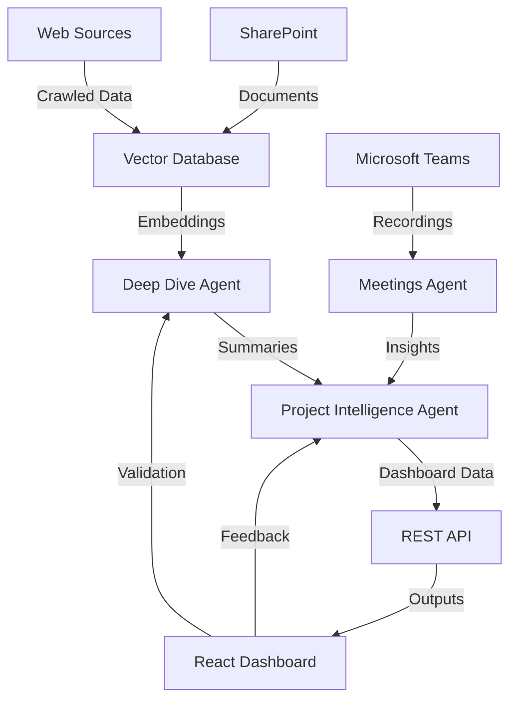
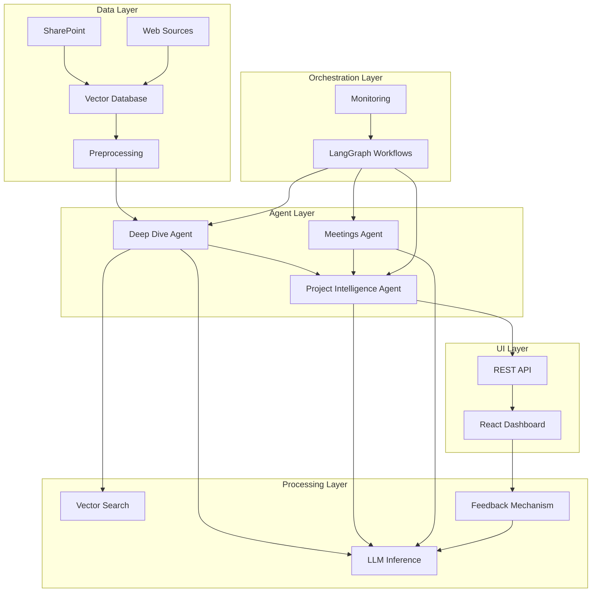
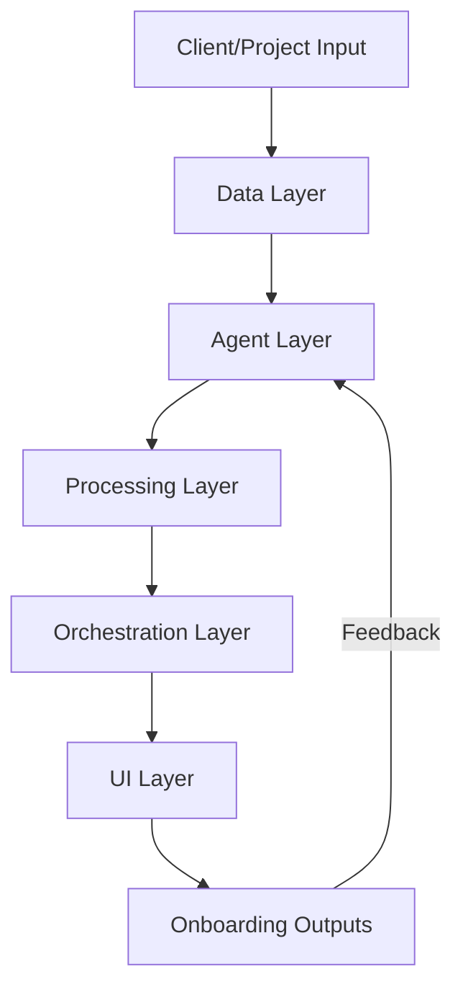

```mermaid
sequenceDiagram
    participant User
    participant DD as Deep Dive Agent
    participant PI as Project Intelligence Agent
    participant MA as Meetings Agent
    participant UI as UI Dashboard
    participant SharePoint
    participant Web
    participant Teams

    User->>DD: Input project/client details
    DD->>SharePoint: Query internal data
    DD->>Web: Search external data
    SharePoint-->>DD: Documents
    Web-->>DD: Web content
    DD->>User: Present results for validation
    User-->>DD: Validate relevance
    DD->>PI: Validated data/summaries
    MA->>Teams: Fetch meeting recordings
    Teams-->>MA: Audio/transcripts
    MA->>PI: Action items/sentiment
    PI->>UI: Consolidated insights
    UI-->>User: Display dashboard
```

```mermaid
graph TD
    A[SharePoint] -->|Documents| B[Vector Database]
    C[Web Sources] -->|Crawled Data| B
    B -->|Embeddings| D[Deep Dive Agent]
    D -->|Summaries| E[Project Intelligence Agent]
    F[Microsoft Teams] -->|Recordings| G[Meetings Agent]
    G -->|Insights| E
    E -->|Dashboard Data| H[REST API]
    H -->|Outputs| I[React Dashboard]
    I -->|Feedback| E
    I -->|Validation| D
```

```mermaid
graph TD
    subgraph Data Layer
        A1[SharePoint]
        A2[Web Sources]
        A3[Vector Database]
        A4[Preprocessing]
        A1 --> A3
        A2 --> A3
        A3 --> A4
    end

    subgraph Agent Layer
        B1[Deep Dive Agent]
        B2[Project Intelligence Agent]
        B3[Meetings Agent]
        A4 --> B1
        B1 --> B2
        B3 --> B2
    end

    subgraph Processing Layer
        C1[LLM Inference]
        C2[Vector Search]
        C3[Feedback Mechanism]
        B1 --> C1
        B1 --> C2
        B2 --> C1
        B3 --> C1
        C3 --> C1
    end

    subgraph UI Layer
        D1[React Dashboard]
        D2[REST API]
        B2 --> D2
        D2 --> D1
        D1 --> C3
    end

    subgraph Orchestration Layer
        E1[LangGraph Workflows]
        E2[Monitoring]
        E1 --> B1
        E1 --> B2
        E1 --> B3
        E2 --> E1
    end
```

```mermaid
graph TD
    A[Client/Project Input] --> B[Data Layer]
    B --> C[Agent Layer]
    C --> D[Processing Layer]
    D --> E[Orchestration Layer]
    E --> F[UI Layer]
    F --> G[Onboarding Outputs]
    G -->|Feedback| C
```
